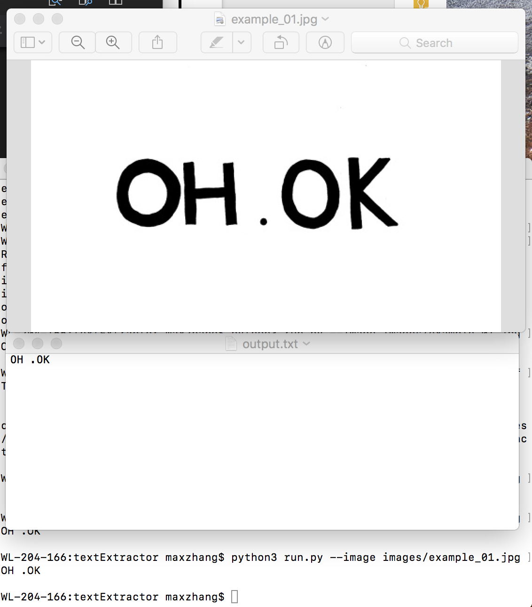

# install tesseract, OpenCV
first step: https://www.pyimagesearch.com/2017/07/03/installing-tesseract-for-ocr/
"brew install tesseract"

Test on tesseract
tesseract example_01.png stdout
tesseract tesseract_inputs/example_03.png stdout digits 

"sudo opt install tesseract-ocr"
https://www.pyimagesearch.com/2017/07/10/using-tesseract-ocr-python/

$ pip3 install pillow
$ pip3 install pytesseract

$ pip3 install opencv-python

## to run

python3 run.py --image images/example_01.png

or 
python3 run.py --image images/example_02.png --preprocess blur

pip3 install imutils

python3 run2.py --east frozen_east_text_detection.pb --image images/example_01.png

Download pb file

# performance

#..
{ width: 200px; }
{ width: 200px; }

